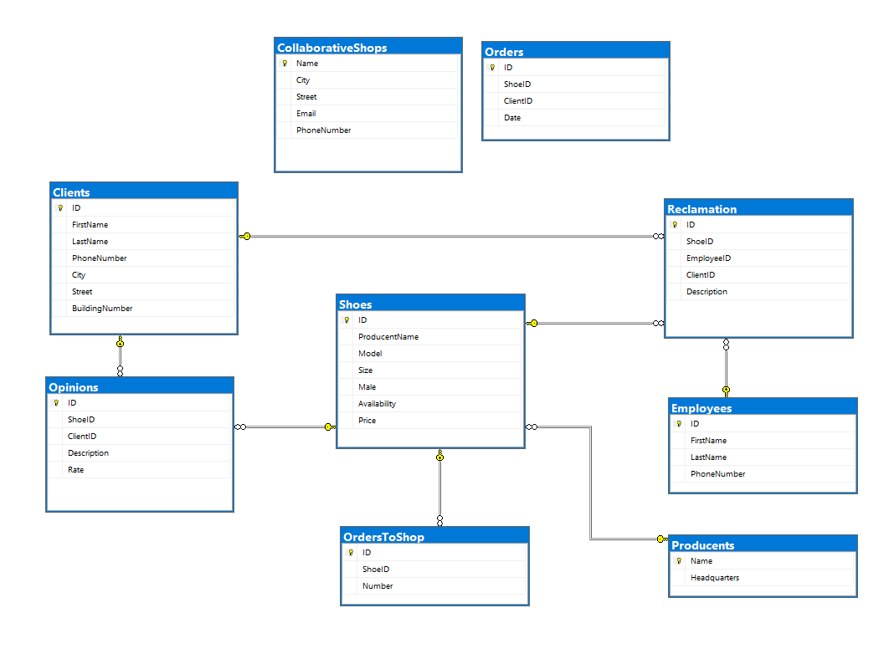
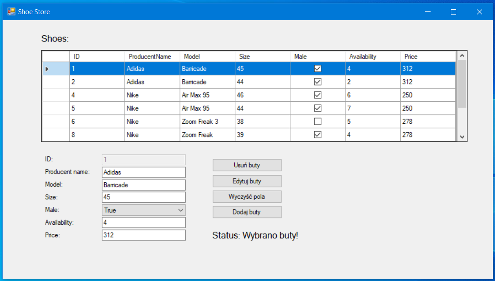

# Laboratory 2
The goal of this laboratory was create simple database in MSSQL and connect it with Windows Forms App. 

## Database diagram

## View of app
  

## Functionality
 - delete selected shoes
 - update selected shoes
 - add new shoes to database
 - view all shoes from database
In conclusion, this is simple CRUD applicaton. 

