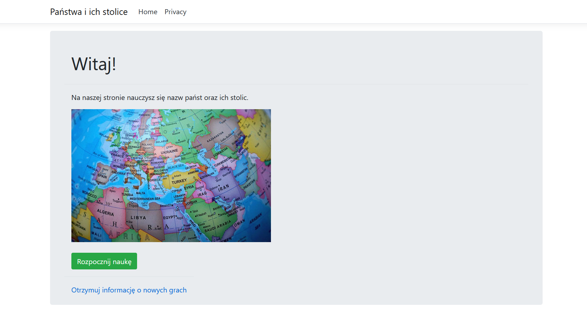
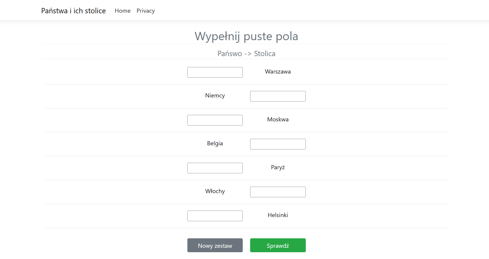
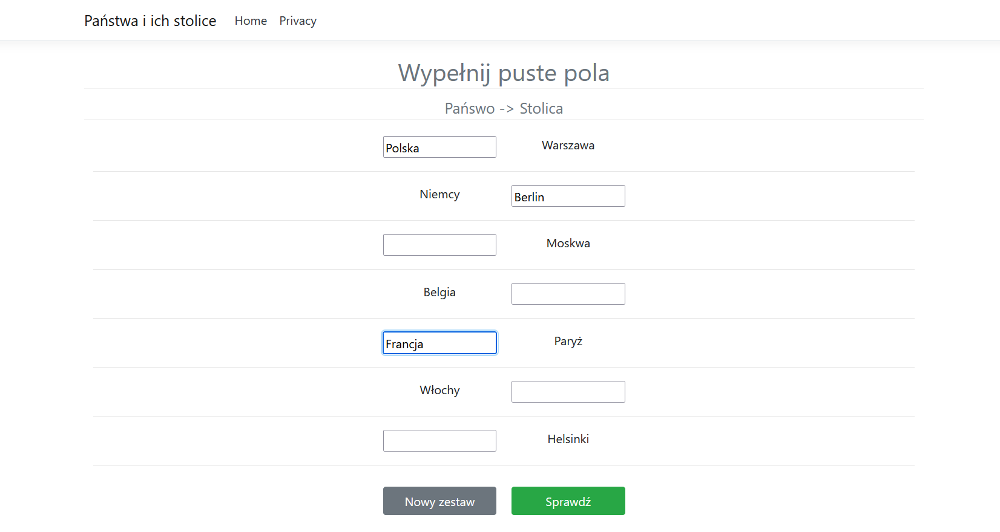
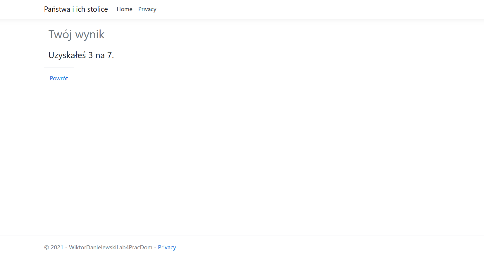
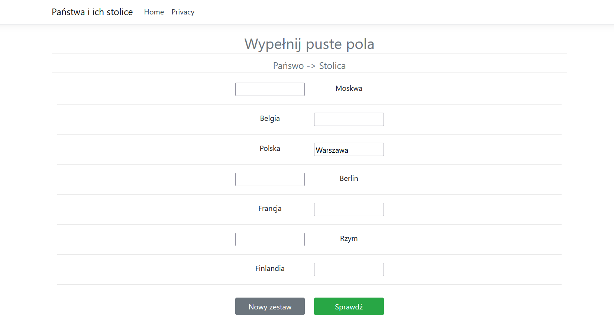
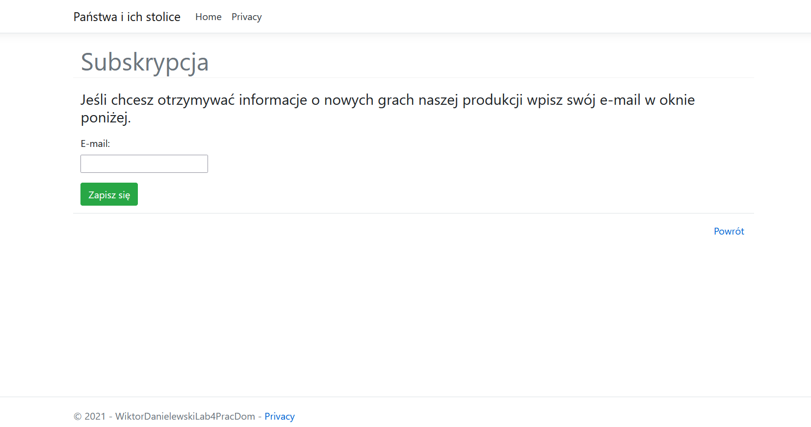
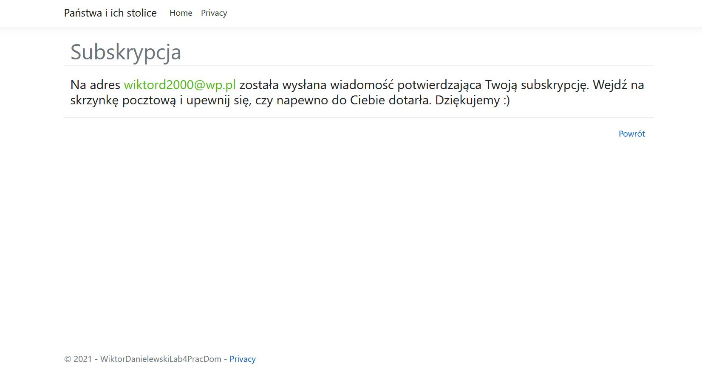

# Laboratory 4 - MVC
The goal of this laboratory was to create MVC project in ASP.NET Core platform.

Model–view–controller (MVC) is a software design pattern commonly used for developing user interfaces that divide the related program logic into three interconnected elements. This is done to separate internal representations of information from the ways information is presented to and accepted from the user.

Traditionally used for desktop graphical user interfaces (GUIs), this pattern became popular for designing web applications. Popular programming languages have MVC frameworks that facilitate implementation of the pattern. 

## View of app

||  |
| :--: | :--: |
| *Home page* | *Study* |

| |  |
| :--: | :--: |
| *Filing gaps* | *Check* |

| |  |
| :--: | :--: |
| *Generate new set* | *Subscription* |

||
|:--:|
|*Subscription message*|

## Functionality
 - learning via filling the gaps
 - generating new set to resolve
 - check correctness of the answers 
 - filling mock subscription and get response view

  
