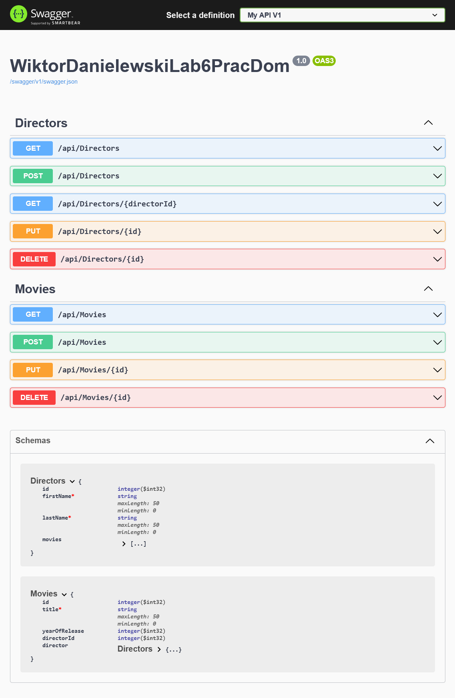

# Laboratory 6 - WebAPI
The goal of this project was to create simple API which will include basic requests i.e. GET, POST, PUT and DELETE.
We can distinguish endpoints assigned to Directors it is: GET all directors or specific via id, POST new director, PUT or DELETE any director by id.
We have also endpoints assigned to Movies they are: GET all movies, POST new movie, PUT or DELETE specific movie by id.

<strong>Note:</strong> All endpoints interact with database which script you can find in project files so you can easily restore it :wink:

<strong>Project template:</strong>  ASP.NET Core Web API (MVC)
 
<strong>Database management:</strong> Microsoft SQL Server (MSSQL)

## Features
 - Manipulating data in database via provided API
 - GET, POST, PUT and DELETE Movies
 - GET x2 (all or specific Director), POST, PUT and DELETE Directors
 - The project is connected with Swagger so you can simply check and test endpoints  

## Screenshots

||
|:--:|
|*Screen from Swagger*|
